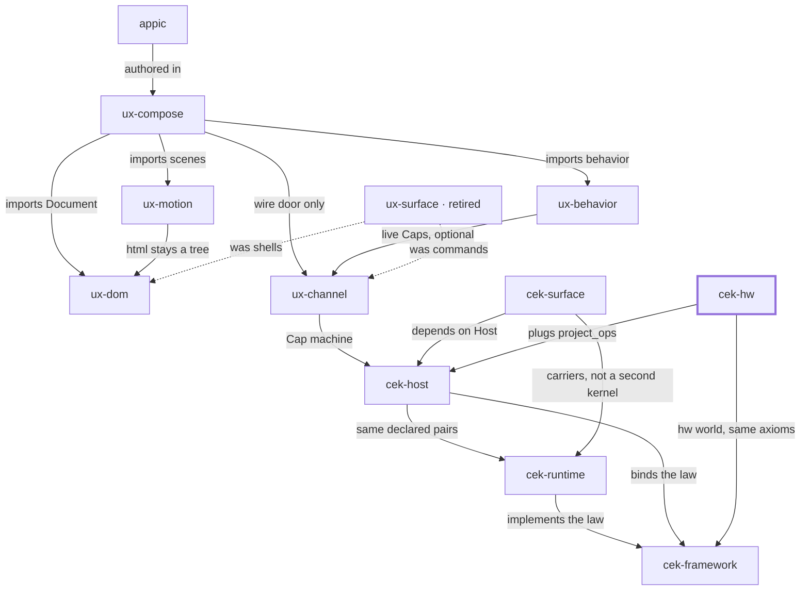

# Place in the stack

**You are here:** `cek-hw` in [bitplorer/cek-hw](https://github.com/bitplorer/cek-hw).

The hardware layer. An hw domain pack, a peer driver, a serial carrier, and an Arduino port. GPIO is another world, like the DOM. Host still decides. Peer still applies.

The picture is the same in every repo. The thick stroke is this library. A missing line is a missing door, not a forgotten one. Dashed lines are history.

## Owns

The hw packs, HwPeer, and the serial frame.

## Refuses

Being the law, forking cek-host, or pretending to be ux-channel.

## Install

Pack tests run with no Host installed. The optional extra is cek-host >= 0.2.0.

## Doors

### Uses

- [cek-host](https://github.com/bitplorer/cek-python) — plugs project_ops
- [cek-framework](https://github.com/bitplorer/cek-framework) — hw world, same axioms

## The stack

## The walk

Mint, intent, verify, project, apply, undo.

1. **Mint.** Host mints a Cap. The subject on the Cap is the subject in the args. dev is the workshop. prod refuses the workshop secret.
2. **Intent.** Channel carries action, args, and cap. That is the click. It is not a form post.
3. **Verify.** Host verifies the Cap before any shared-world write. A bad Cap, or a store that is down, refuses. ops is empty. The peer never mints.
4. **Project.** **This library.** Only declared pairs leave the host. Baseline and ui.dom are the catalog. Hardware pairs arrive through project_ops. They are not a fork of Host.
5. **Apply.** The peer applies the ops. DOM is one world. GPIO is another. Surface carries the IR. It does not decide.
6. **Undo.** Lineage records the cause. End or revoke reverses it, or the op is marked non-reversible. A trace id never grants permission.

This library is step 4 of the walk. The pairs are passed in. They are not a second Host.

## Notes

- Plug in with Host.submit(..., project_ops=project_action(...)).
- Cap.subject must equal args["subject"].
- The scope is action:hw.gpio.write, not device:.
